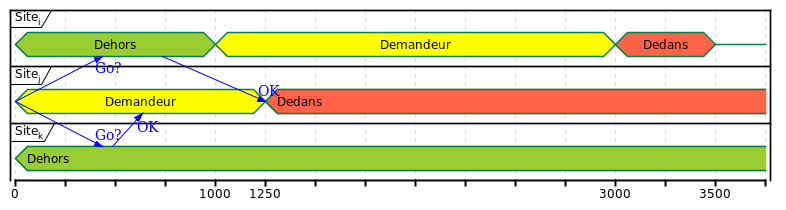

# Meikodayo
_**\[Rough WIP\]** #distributedsystems #softviz_  
A process-based simulator/visualizer for distributed mutual exclusion algorithms that we have "learned" in univ.

**Warning**:
This thing is untested and only written to help myself better understand these algorithms and to see if I could do something similar to Maelstrom.  
For serious stuff, use or fork the real thing:
[@jepsen-io/maelstrom](https://github.com/jepsen-io/maelstrom "A workbench for writing toy implementations of distributed systems.")!


Names considered:

- **Mikudayo**, as in that cursed VOCALOID thing ([Know Your Meme](https://knowyourmeme.com/memes/mikudayo)!).

- **Meiko** sounds a bit like Maelstrom--it alliterates ("initial rhyme").
    Plus, MEIKO's theme color looks like Jepsen's brand color(?).  
    (Jepsen's Maelstrom, Djalil's Meiko, see what I'm trying to come up with? Nobody cares.)

- **Meikodayo** is a little too long, but it's a fitting name for this monstrosity (as in _Mikudayo_, _KAITOdayo_, and _MEIKOdayo_).


## Algorithms

For more details, see each algorithm's "Javadoc" documentation comment:

`SiteProcess/algorithms/`:

- `Coordinator`

- `RicartAgrawala`

- `CarvalhoRoucairol`

- `ChandyMisra`

- `Maekawa`

- `Lamport`

- `Lann`

- `SuzukiKasami` (both the "initial" and the "final" versions)


## How?

_(You may want to check Maelstrom's docs and specifically [the "Gossip-Based Broadcast" chapter](https://github.com/jepsen-io/maelstrom/blob/main/doc/03-broadcast/01-broadcast.md).)_

Why does it work?


About **nodes**:

- Each node is a process (i.e. a running program).

- Incoming messages are read from the `stdin`.

- Outgoing messages are written to the `stdout`.

- Logs can be written to the `stderr`.

- Implementation assumption: Nodes are single-threaded.


About **messages**:

- Messages are JSON-encoded and have three mandatory fields: `{ Type:string, Src:string, Dst:string, ... }`.
    * `Src` and `Dst` are the Source and Destination of the message. Named as in Wireshark filters.

- Messages are exchanged via a simulated network (a simplistic wireless star topology).
    * Imagine those `stdin` and `stdout` as our wireless network interface's `1-TX 1-RX` (1-**T**ransmitter and 1-**R**eceiver antennas(?)).
        + [ ] TODO: Am I making sense here? #wireless


About the **visualization**:

- Currently,  it visualizes the network state and messages from the logs/journals of each node.
    * Will be updated later. The goal is to make the simulation and visualization more dynamic and real-time.

- It (mis)uses PlantUML's UML timing diagram,
and relies on its ability to generate correct diagrams from unordered "directives" (given correct and **absolute** timestamps, of course).
    * See the `TimingDiagramLogger` class.
    * See [Timing Diagram syntax and features | PlantUML](https://plantuml.com/en/timing-diagram).

Rendered `TestTimingDiagram.puml`:  



## Conventions

- The terms _Node_ and _Site_ are used interchangeably, with the latter being what we are used to in univ.

- Variable `i` is for the current node (remember: _I_).

- Variable `j` is for the other node (remember: `j` as in `/ju/`, _you_).

- `WaitFor(condition);` is `while (! (condition) )`.
    - [ ] Instead of an active wait (`noop`), we should do `waitWhileReceivingMessage()`
    Maybe we should add a OnMessage method to be used both by the algo class itself and the main `Program`.
    See [TODO.md](TODO.md).


## Notes / Ramblings

- _**This thing is far from complete.
See [TODO.md](TODO.md).**_

- Originally was going to use Java and rely on a convenient feature of JDK 11:
[JEP 330: Launch Single-File Source-Code Programs](https://openjdk.java.net/jeps/330).  
The only reason I've decided to use CSharp (C#.NET 5) is because it supports JSON natively...
also because I wanted to get used to C# and get familiar with new APIs and language features.

- (Was) being developed using JetBrains Rider on Kubuntu 18.04 x64. Rider's **About**:
```
JetBrains Rider 2021.1.2
For educational use only.
Linux 5.4.0-72-generic
.NET Core 5.0.5
Non-Bundled Plugins: PlantUML integration (5.2.0), [...]

[...]
```


## License

By Abdeldjalil Hebal, 2021, CC BY 4.0
